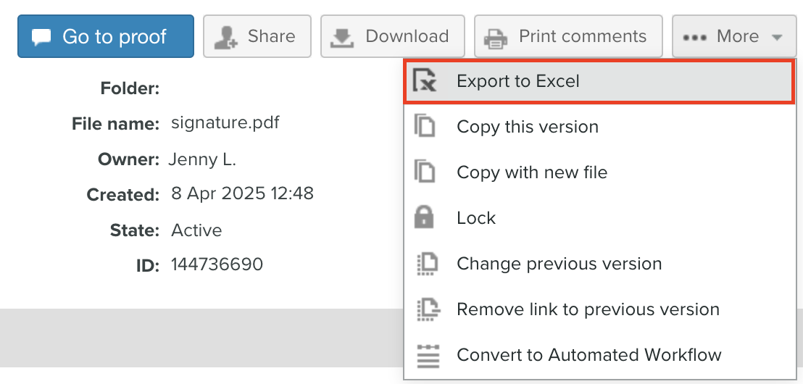

# Stampa ed esporta commenti in [!DNL Workfront Proof]

>[!IMPORTANT]
>
>Questo articolo fa riferimento alle funzionalità nel prodotto autonomo [!DNL Workfront Proof]. Per informazioni sulla verifica all&#39;interno di [!DNL Adobe Workfront], vedere [Verifica](../../../review-and-approve-work/proofing/proofing.md).

## Stampa dei commenti

Il riepilogo Commenti è accessibile direttamente dalle seguenti aree:

* [Visualizzatore bozze](#the-proof-viewer)
* [Pagina Dettagli bozza](#the-proof-details-page)
* [Menu  [!DNL Proof] Azioni](#the-proof-actions-menu)

### Visualizzatore bozze {#the-proof-viewer}

È possibile stampare il riepilogo dei commenti della bozza, incluse le miniature o l&#39;immagine completa della bozza, facendo clic sull&#39;icona **[!UICONTROL Stampa]** nel Visualizzatore bozze.

Per accedere al Visualizzatore bozze, fare clic sul pulsante **Vai alla bozza** nella pagina Dettagli bozza.

### Pagina Dettagli bozza {#the-proof-details-page}

Puoi stampare il riepilogo dei commenti della bozza facendo clic sull&#39;icona **[!UICONTROL Stampa]** nella pagina Dettagli bozza.

Per accedere alla pagina Dettagli bozza per una bozza specifica, fai clic sul nome della bozza nella vista a elenco.

### Menu Azioni [!DNL Proof] {#the-proof-actions-menu}

Puoi stampare il riepilogo dei commenti della bozza facendo clic sull&#39;icona **[!UICONTROL Stampa]** nel menu [!UICONTROL Azioni bozza].

Per accedere alla pagina [!UICONTROL Riepilogo commenti] da una visualizzazione elenco:

1. Fare clic sul menu **[!UICONTROL Azioni]**.
1. Seleziona **[!UICONTROL Stampa commenti]**.

   

   Nella pagina Riepilogo commenti selezionare una delle opzioni di stampa seguenti:

   * Visualizzazione miniature (1)
   * Visualizzazione a pagina intera (2)
   * Stampa la pagina (3)
   * Esporta la bozza con commenti in un file PDF (4)
   * Esporta i commenti della bozza in un file [!DNL Excel] (5)

### Visualizzazione miniature

La visualizzazione Anteprima mostra ogni commento in ordine di sequenza, con il thread completo per ogni commento. È inoltre possibile ordinare i commenti e visualizzare la miniatura di ogni commento con le marcature aggiunte.

Per stampare la visualizzazione delle miniature, fare clic sull&#39;icona **[!UICONTROL Stampante]** nell&#39;angolo superiore destro della pagina e selezionare una delle opzioni seguenti:

* Ordina per ID commento o pagina (1)
* Miniatura per ogni commento con marcature aggiunte (2)

### Visualizzazione a pagina intera

La visualizzazione a pagina intera mostra ogni pagina in ordine con i commenti sulla pagina e un pin che indica dove si trova il commento.

Per stampare la visualizzazione a pagina intera, fare clic sull&#39;icona **[!UICONTROL Stampante]** nell&#39;angolo superiore destro della pagina.

## Esportazione di un riepilogo [!DNL Excel]

Per esportare il riepilogo [!DNL Excel] dal menu Azioni bozza:

1. Fai clic sull&#39;icona **Azioni** a destra della bozza, quindi seleziona **[!UICONTROL [!DNL Excel]riepilogo]**.
   

Per scaricare il riepilogo [!DNL Excel] dalla pagina Dettagli bozza:

1. Fai clic sul pulsante **Altro**, quindi seleziona **Esporta in Excel**.

   

## Esportazione in PDF

Quando si esegue l&#39;esportazione in un file PDF, tutti i commenti verranno visualizzati nel lettore PDF. Se a un commento sono associati più markup, il commento verrà visualizzato più volte nell&#39;elenco dei commenti (una volta per ogni markup).

>[!IMPORTANT]
>
>La funzione Esporta in PDF è disponibile solo per i file statici.

Per esportare una bozza con i relativi markup e commenti in PDF:

1. Nella parte sinistra della schermata, fai clic su **[!UICONTROL Visualizzazioni]**.
1. Fai clic sul pulsante **[!UICONTROL Altro]** in linea con la bozza specifica, quindi seleziona **[!UICONTROL Stampa commenti]**.

1. Nell&#39;angolo superiore destro della pagina fare clic sul pulsante **Esporta in PDF**. Il PDF inizia il download e riceverai un’e-mail una volta completato.
