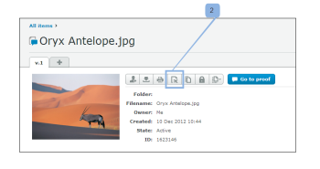

# Stampa ed esporta commenti in [!DNL Workfront Proof]

>[!IMPORTANT]
>
>Questo articolo fa riferimento alla funzionalità del prodotto standalone [!DNL Workfront Proof]. Per informazioni sulle prove all&#39;interno [!DNL Adobe Workfront], vedi [Copertura](../../../review-and-approve-work/proofing/proofing.md).

## Stampa dei commenti

Il riepilogo dei commenti è accessibile direttamente dalle seguenti aree:

* [Visualizzatore di prove](#the-proof-viewer)
* [Pagina Dettagli bozza](#the-proof-details-page)
* [La [!DNL Proof] Menu Azioni](#the-proof-actions-menu)

### Visualizzatore di prove {#the-proof-viewer}

Puoi stampare il riepilogo dei commenti della bozza, incluse le miniature o l’immagine a vista completa della bozza, facendo clic sul pulsante **[!UICONTROL Stampa]** nel visualizzatore delle prove. (1)

### Pagina Dettagli bozza {#the-proof-details-page}

Puoi stampare il riepilogo dei commenti della bozza facendo clic sul pulsante **[!UICONTROL Stampa]** nella pagina Dettagli bozza . (2)

### La [!DNL Proof] Menu Azioni {#the-proof-actions-menu}

Puoi stampare il riepilogo dei commenti della bozza facendo clic sul pulsante **[!UICONTROL Stampa]** nella [!UICONTROL Azioni di prova] menu.

Per accedere al [!UICONTROL Riepilogo commenti] da una vista a elenco:

1. Fai clic sul pulsante **[!UICONTROL Azioni]** menu. (3)
1. Seleziona **[!UICONTROL Stampa commenti]**. (4)

\
Nella pagina di riepilogo dei commenti sono disponibili le seguenti opzioni di stampa tra cui scegliere:

* Visualizzazione thumbnail (1)
* Vista a pagina intera (2)
* Stampa la pagina (3)
* Esporta la bozza con i commenti in un file PDF (4)
* Esporta i commenti della bozza in un [!DNL Excel] file (5)

### Visualizzazione miniature

La visualizzazione Miniatura mostra ogni commento in ordine, insieme al thread completo per ogni commento. È inoltre possibile ordinare i commenti e visualizzare la miniatura di ogni commento con le marcature aggiunte.

Per stampare la visualizzazione delle miniature, fai clic sul pulsante **[!UICONTROL Stampante]** nell’angolo in alto a destra della pagina e seleziona una delle seguenti opzioni:

* Ordina per ID commento o pagina (1)
* Miniatura per ogni commento con le marcature aggiunte (2)

### Visualizzazione a pagina intera

La visualizzazione a pagina intera mostra ciascuna pagina in ordine, insieme ai commenti presenti nella pagina e un pin che indica la posizione del markup per il commento nella pagina.

Per stampare la visualizzazione a pagina intera, fai clic sul pulsante **[!UICONTROL Stampante]** nell’angolo in alto a destra della pagina.

## Esportazione di un [!DNL Excel] Riepilogo

Per scaricare i [!DNL Excel] riepilogo:

1. Apri il menu azioni della bozza a destra della bozza, quindi fai clic su **[!UICONTROL [!DNL Excel]sommario]**. (1)\
   

Per scaricare i [!DNL Excel] riepilogo dalla pagina dei dettagli della bozza:

1. Fai clic su Esporta in **[!DNL Excel]** icona. (2)
1. 

## Esportazione in PDF

Per esportare una bozza in PDF, insieme a tutte le marcature e i commenti, effettua le seguenti operazioni:

1. Vai a **[!UICONTROL Viste]** sul lato sinistro dello schermo.
1. Fai clic sul pulsante **[!UICONTROL Altro]** icona in linea con una bozza, quindi fai clic su **[!UICONTROL Stampa commenti]**.

1. Fai clic sull’icona Esporta in PDF nell’angolo in alto a destra della pagina.

   Quando PDF è pronto, riceverai un’e-mail con un collegamento per il download.

Tutti i commenti verranno visualizzati nel lettore PDF. Se a un commento sono associate più marcature, il commento verrà visualizzato più volte nell’elenco dei commenti (una volta per ogni markup).

>[!IMPORTANT]
>
>La funzione Esporta in PDF è disponibile solo per i file statici.
