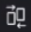
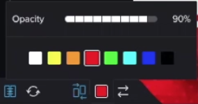
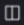

# Confrontare le bozze nel visualizzatore di bozze

>[!IMPORTANT]
>
>Questo articolo fa riferimento alla funzionalità del prodotto standalone [!DNL Workfront Proof]. Per informazioni sulle prove all&#39;interno [!DNL Adobe Workfront], vedi [Copertura](../../../review-and-approve-work/proofing/proofing.md).

È possibile visualizzare confronti affiancati di due bozze. Possono essere due versioni della stessa bozza, o due prove completamente separate.

## Confronto delle versioni a prova di confronto {#compare-proof-versions}

1. Apri la bozza con più versioni da confrontare.
1. Nell’angolo in alto a sinistra del visualizzatore di correzione visualizzato, fai clic sul nome della bozza. Quindi, nell&#39;elenco delle versioni visualizzate, fai clic sul pulsante **Confronto** accanto alla versione da aprire e confrontare.

   

   Le bozze vengono visualizzate una accanto all’altra, con la versione più recente sul lato sinistro.

   <!--
   
Separate breadcrumbs above each proof allow you to view and go to the work item associated with the proof:

   -->

   <!--
   
  

   -->

1. Continua con [Utilizzare gli strumenti di confronto](#use-the-compare-tools).

## Confrontare bozze separate {#compare-separate-proofs}

È possibile confrontare due prove separate.

* [Confrontare bozze separate in [!DNL Workfront]](#compare-separate-proofs-in-workfront)
* [Confrontare bozze separate in [!DNL Workfront Proof]](#compare-separate-proofs-in-workfront-proof)

### Confrontare bozze separate in [!DNL Workfront] {#compare-separate-proofs-in-workfront}

Per informazioni sul confronto di bozze separate dall&#39;elenco dei documenti in [!DNL Workfront], vedi [Confrontare due prove diverse](../../../review-and-approve-work/proofing/reviewing-proofs-within-workfront/review-a-proof/compare-proofs.md#comparing-two-proofs-from-a-document-list) nella sezione [Confronta bozze](../../../review-and-approve-work/proofing/reviewing-proofs-within-workfront/review-a-proof/compare-proofs.md) articolo.

### Confrontare bozze separate in [!DNL Workfront Proof] {#compare-separate-proofs-in-workfront-proof}

>[!NOTE]
>
>Le bozze confrontate devono trovarsi nella stessa cartella e allo stesso livello di gerarchia all’interno della struttura delle cartelle. Per ulteriori informazioni sull&#39;utilizzo delle cartelle per raggruppare le bozze che si desidera confrontare, vedere [Utilizzare più bozze nel visualizzatore di correzione](../../../workfront-proof/wp-work-proofsfiles/review-proofs-wpv/work-with-multiple-proofs.md)

1. Apri una delle bozze da confrontare nel visualizzatore di correzione.
1. Fai clic sul pulsante **[!UICONTROL Modalità di confronto]** icona.

   \
   L’area di visualizzazione si divide in due e la bozza viene visualizzata sia a sinistra che a destra del visualizzatore di correzione.

   

1. Fai clic sul pulsante [!UICONTROL cartella] sopra la bozza a sinistra o a destra per elencare le altre bozze all’interno della stessa cartella.

   

1. Nell’elenco, fai clic sul nome della bozza da confrontare con la bozza attualmente aperta nel visualizzatore di correzione.

   

   Vengono visualizzate entrambe le bozze.

1. Continua con [Utilizzare gli strumenti di confronto](#use-the-compare-tools).

## Utilizzare gli strumenti di confronto {#use-the-compare-tools}

Il visualizzatore di correzione fornisce vari strumenti per confrontare le bozze in modo efficace ed efficiente.

* [Confronto automatico delle bozze](#auto-compare-proofs)
* [Confrontare le bozze in una sovrapposizione](#compare-proofs-in-an-overlay)
* [Confronto simultaneo della navigazione](#simultaneous-navigation-comparison)

### Confronto automatico delle bozze {#auto-compare-proofs}

Il confronto automatico effettua un confronto pixel per pixel tra due bozze statiche o video. Le differenze rilevate vengono evidenziate in rosso nella prova a sinistra.

Il confronto automatico non è disponibile quando si confrontano le bozze interattive.

Per confrontare automaticamente due bozze:

1. Inizia a confrontare le bozze in uno dei seguenti modi:

   * Confrontare due versioni della stessa bozza (vedi [Confronto delle versioni a prova di confronto](#compare-proof-versions) in questo articolo).
   * Confrontare due bozze separate (vedi [Confrontare bozze separate](#compare-separate-proofs) in questo articolo).

1. Fai clic sul pulsante **[!UICONTROL Confronto automatico]** icona.

   

   Le eventuali differenze tra le due prove sono evidenziate in rosso nella prova a sinistra.

1. (Facoltativo) Fai clic sul pulsante **[!UICONTROL Interruttore]** per modificare il lato attivo in modo che le differenze vengano visualizzate sulla bozza a destra. Per impostazione predefinita, le differenze vengono visualizzate sulla bozza sul lato sinistro.

   

1. (Facoltativo) Fai clic sul pulsante **[!UICONTROL Colore]** per modificare il colore e l&#39;opacità utilizzati per evidenziare le differenze.

   

### Confrontare le bozze in una sovrapposizione {#compare-proofs-in-an-overlay}

Il confronto delle sovrapposizioni consente di visualizzare le differenze tra due bozze statiche visualizzando le due bozze come un’unica bozza, mentre fornisce un divisore verticale al centro della bozza. Quando si esegue il panning della bozza sul divisore verticale, vengono visualizzate le differenze.

>[!NOTE]
>
>Il confronto delle sovrapposizioni non è disponibile quando si confrontano bozze video o interattive.

Per abilitare il confronto delle sovrapposizioni:

1. Inizia a confrontare le bozze in uno dei seguenti modi:

   * Confrontare due versioni della stessa bozza (vedi [Confronto delle versioni a prova di confronto](#compare-proof-versions) in questo articolo).
   * Confrontare due bozze separate (vedi [Confrontare bozze separate](#compare-separate-proofs) in questo articolo).

1. Fai clic sul pulsante **[!UICONTROL Sovrapposizione]** icona.

   

   Le due bozze vengono visualizzate come prova singola, con un divisore verticale al centro della bozza.

1. Effettua una delle seguenti operazioni:

   * Eseguire il panning della bozza attraverso il divisore verticale. Mentre eseguite il panning, potete vedere la prova a sinistra sul lato sinistro del divisore verticale, mentre la prova a destra viene visualizzata sul lato destro.
   * Spostare il divisore verticale a sinistra e a destra. Spostando il divisore, si vede la prova a sinistra sul lato sinistro del divisore verticale, mentre la prova a destra viene visualizzata sul lato destro.

### Confronto simultaneo della navigazione {#simultaneous-navigation-comparison}

La navigazione simultanea è abilitata per impostazione predefinita quando si confrontano le bozze. È disponibile quando si confronta una bozza statica e una bozza statica, o quando si confronta una bozza video e video. Non è disponibile quando si confronta una bozza statica e una bozza video.

**Prove statiche:** Quando è attivata la prova statica, la navigazione simultanea blocca il livello di zoom e la posizione delle due bozze durante la panoramica o lo scorrimento. Quando una bozza contiene più pagine e la navigazione simultanea è attivata, la modifica delle pagine in una bozza comporta la modifica della pagina nell’altra bozza.

**Prove video:** Quando è attivata la prova video, la navigazione simultanea ricorda la differenza di tempo sulla timeline delle due prove.

Per abilitare la navigazione simultanea, se non è già abilitata:

1. Inizia a confrontare le bozze in uno dei seguenti modi:

   * Confrontare due versioni della stessa bozza (vedi [Confronto delle versioni a prova di confronto](#compare-proof-versions) in questo articolo).
   * Confrontare due bozze separate (vedi [Confrontare bozze separate](#compare-separate-proofs) in questo articolo).

1. Fai clic sul pulsante **[!UICONTROL Navigazione simultanea]** icona.

   

1. (Facoltativo) Fai clic sul pulsante **[!UICONTROL Reimposta]** in qualsiasi momento per ripristinare il livello di zoom e la posizione (per la prova statica) o la timeline (per le prove video).

   

## Esci da modalità di confronto

1. Per chiudere la bozza che non desideri più visualizzare, fai clic sull’icona (x) nell’angolo in alto a sinistra della bozza.

   

   La prova che non chiudi rimane aperta nel visualizzatore di correzione.
