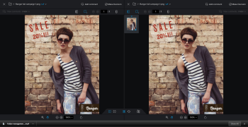
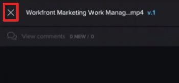

# Confronta bozze nel visualizzatore di bozze

>[!IMPORTANT]
>
>Questo articolo fa riferimento alle funzionalità nel prodotto autonomo [!DNL Workfront Proof]. Per informazioni sulla verifica all&#39;interno di [!DNL Adobe Workfront], vedere [Verifica](../../../review-and-approve-work/proofing/proofing.md).

Puoi visualizzare confronti affiancati di due bozze. Possono essere due versioni della stessa bozza o due bozze completamente separate.

## Confrontare le versioni delle bozze {#compare-proof-versions}

1. Apri la bozza con più versioni che desideri confrontare.
1. Nell&#39;angolo superiore sinistro del visualizzatore di bozze visualizzato fare clic sul nome della bozza. Nell&#39;elenco delle versioni visualizzate fare clic sull&#39;icona **Confronta** accanto alla versione che si desidera aprire e confrontare.

   

   Le bozze vengono visualizzate una accanto all’altra, con la versione più recente a sinistra.

   <!--
   
Separate breadcrumbs above each proof allow you to view and go to the work item associated with the proof:

   -->

   <!--
   
  

   -->

1. Continua con [Utilizza gli strumenti di confronto](#use-the-compare-tools).

## Confrontare bozze separate {#compare-separate-proofs}

Puoi confrontare due bozze separate.

* [Confronta bozze separate in [!DNL Workfront]](#compare-separate-proofs-in-workfront)
* [Confronta bozze separate in [!DNL Workfront Proof]](#compare-separate-proofs-in-workfront-proof)

### Confronta bozze separate in [!DNL Workfront] {#compare-separate-proofs-in-workfront}

Per informazioni sul confronto di bozze separate dall&#39;elenco dei documenti in [!DNL Workfront], vedere la sezione [Confrontare due bozze diverse](../../../review-and-approve-work/proofing/reviewing-proofs-within-workfront/review-a-proof/compare-proofs.md#comparing-two-proofs-from-a-document-list) nell&#39;articolo [Confrontare le bozze](../../../review-and-approve-work/proofing/reviewing-proofs-within-workfront/review-a-proof/compare-proofs.md).

### Confronta bozze separate in [!DNL Workfront Proof] {#compare-separate-proofs-in-workfront-proof}

>[!NOTE]
>
>Le bozze confrontate devono trovarsi nella stessa cartella e allo stesso livello gerarchico all’interno della struttura della cartella. Per ulteriori informazioni sull&#39;utilizzo delle cartelle per raggruppare le bozze che si desidera confrontare, vedere [Operazioni con più bozze nel visualizzatore di bozze](../../../workfront-proof/wp-work-proofsfiles/review-proofs-wpv/work-with-multiple-proofs.md)

1. Apri una delle bozze che desideri confrontare nel visualizzatore di bozze.
1. Fare clic sull&#39;icona **[!UICONTROL Modalità confronto]**.

   \
   L’area di visualizzazione si divide a metà e la bozza viene visualizzata sul lato sinistro e destro del visualizzatore di bozze.

   

1. Fai clic sull&#39;icona [!UICONTROL cartella] sopra la bozza a sinistra o a destra per elencare le altre bozze all&#39;interno della stessa cartella.

   

1. Nell&#39;elenco fare clic sul nome della bozza che si desidera confrontare con la bozza attualmente aperta nel visualizzatore di bozze.

   

   Vengono visualizzate entrambe le bozze.

1. Continua con [Utilizza gli strumenti di confronto](#use-the-compare-tools).

## Utilizzare gli strumenti di confronto {#use-the-compare-tools}

Il visualizzatore di bozze fornisce diversi strumenti per confrontare le bozze in modo efficace ed efficiente.

* [Confronto automatico delle bozze](#auto-compare-proofs)
* [Confrontare le bozze in una sovrapposizione](#compare-proofs-in-an-overlay)
* [Confronto simultaneo delle funzioni di navigazione](#simultaneous-navigation-comparison)

### Confronto automatico delle bozze {#auto-compare-proofs}

La funzione di confronto automatico esegue un confronto pixel per pixel tra due bozze statiche o video. Tutte le differenze rilevate vengono evidenziate in rosso nella bozza a sinistra.

Il confronto automatico non è disponibile quando si confrontano bozze interattive.

Per confrontare automaticamente due bozze:

1. Inizia a confrontare le bozze in uno dei seguenti modi:

   * Confrontare due versioni della stessa bozza (vedere [Confrontare le versioni delle bozze](#compare-proof-versions) in questo articolo).
   * Confronta due bozze separate (vedi [Confronta bozze separate](#compare-separate-proofs) in questo articolo).

1. Fai clic sull&#39;icona **[!UICONTROL Confronto automatico]**.

   

   Eventuali differenze tra le due bozze vengono evidenziate in rosso nella bozza a sinistra.

1. (Facoltativo) Fai clic sull&#39;icona **[!UICONTROL Switch]** per modificare il lato attivo in modo che le differenze vengano visualizzate sulla bozza a destra. Per impostazione predefinita, le differenze sono visualizzate sulla bozza sul lato sinistro.

   

1. (Facoltativo) Fai clic sull&#39;icona **[!UICONTROL Colore]** per modificare il colore e l&#39;opacità utilizzati per evidenziare le differenze.

   

### Confrontare le bozze in una sovrapposizione {#compare-proofs-in-an-overlay}

Il confronto della sovrapposizione consente di visualizzare le differenze tra due bozze statiche visualizzandole come una singola bozza e fornendo al tempo stesso un divisore verticale lungo il centro della bozza. Quando si effettua una panoramica della bozza sul divisore verticale, vengono visualizzate le differenze.

>[!NOTE]
>
>Il confronto delle sovrapposizioni non è disponibile quando si confrontano video o bozze interattive.

Per abilitare il confronto delle sovrapposizioni:

1. Inizia a confrontare le bozze in uno dei seguenti modi:

   * Confrontare due versioni della stessa bozza (vedere [Confrontare le versioni delle bozze](#compare-proof-versions) in questo articolo).
   * Confronta due bozze separate (vedi [Confronta bozze separate](#compare-separate-proofs) in questo articolo).

1. Fai clic sull&#39;icona **[!UICONTROL Sovrapposizione]**.

   

   Le due bozze vengono visualizzate come una singola bozza, con un divisore verticale lungo il centro della bozza.

1. Effettuare una delle seguenti operazioni:

   * Spostare la bozza sul divisore verticale. Mentre si effettua una panoramica, la bozza viene visualizzata sul lato sinistro del divisore verticale, mentre la bozza sul lato destro viene visualizzata sul lato destro.
   * Spostare il divisore verticale a sinistra e a destra. Spostando il divisore, la bozza viene visualizzata a sinistra del divisore verticale, mentre la bozza a destra viene visualizzata sul lato destro.

### Confronto simultaneo delle funzioni di navigazione {#simultaneous-navigation-comparison}

La navigazione simultanea è abilitata per impostazione predefinita durante il confronto delle bozze. È disponibile quando si confrontano una bozza statica e una bozza statica o quando si confrontano una bozza video e una bozza video. Non è disponibile quando si confrontano una bozza statica e una bozza video.

**Bozze statiche:** Quando è abilitata nelle bozze statiche, la navigazione simultanea blocca il livello di zoom e la posizione delle due bozze durante la panoramica o lo scorrimento. Quando una bozza contiene più pagine e viene abilitata la navigazione simultanea, la modifica delle pagine in una bozza determina la modifica della pagina nell’altra bozza.

**Bozze video:** Quando è abilitata nelle bozze video, la navigazione simultanea ricorda la differenza di ora nelle timeline delle due bozze.

Per abilitare la navigazione simultanea se non è già abilitata:

1. Inizia a confrontare le bozze in uno dei seguenti modi:

   * Confrontare due versioni della stessa bozza (vedere [Confrontare le versioni delle bozze](#compare-proof-versions) in questo articolo).
   * Confronta due bozze separate (vedi [Confronta bozze separate](#compare-separate-proofs) in questo articolo).

1. Fai clic sull&#39;icona **[!UICONTROL Navigazione simultanea]**.

   

1. (Facoltativo) Fai clic sull&#39;icona **[!UICONTROL Reimposta]** in qualsiasi momento per reimpostare il livello e la posizione di zoom (per bozza statica) o la timeline (per bozze video).

   

## Esci dalla modalità di confronto

1. Per chiudere la bozza che non desideri più visualizzare, fai clic sull’icona (x) nell’angolo in alto a sinistra della bozza.

   

   La bozza che non si chiude rimane aperta nel visualizzatore di bozze.
