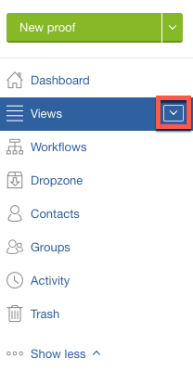

# Apertura di una bozza in [!DNL Workfront Proof]

>[!IMPORTANT]
>
>Questo articolo fa riferimento alle funzionalità nel prodotto autonomo [!DNL Workfront Proof]. Per informazioni sulla verifica all&#39;interno di [!DNL Adobe Workfront], vedere [Verifica](../../../review-and-approve-work/proofing/proofing.md).

1. Fai clic sul pulsante freccia giù accanto a **[!UICONTROL Visualizzazioni]** nella barra laterale.\
   

1. Scegliere **[!UICONTROL Tutti gli elementi]** nel menu visualizzato.
1. Fare clic sull&#39;icona **[!UICONTROL Vai alla bozza]** per la bozza che si desidera visualizzare.\
   \
   Il visualizzatore di bozze predefinito viene avviato in una nuova scheda nel browser e lo stato attivo passa a tale scheda. È possibile aprire più bozze contemporaneamente, ciascuna nella propria scheda.

1. Continuare con uno dei seguenti articoli, a seconda del visualizzatore di bozze in uso.

   * Per eseguire la verifica nel visualizzatore bozze Web, vedere [Verifica delle bozze nel visualizzatore bozze Web.](https://support.workfront.com/hc/en-us/sections/115000275214)
   * Per eseguire la verifica nel Visualizzatore bozze desktop, vedere [Verifica delle bozze nel Visualizzatore bozze desktop.](https://support.workfront.com/hc/en-us/search/click?data=BAh7CjoHaWRsKwjm7%2BTRUwA6CXR5cGVJIgxhcnRpY2xlBjoGRVQ6CHVybEkiVC9oYy9lbi11cy9hcnRpY2xlcy8zNjAwMDM3MjczMzQtUmV2aWV3aW5nLVByb29mcy1pbi10aGUtRGVza3RvcC1Qcm9vZmluZy1WaWV3ZXIGOwdUOg5zZWFyY2hfaWRJIik0NDIyMjdkZi0zYTA4LTQ2YjItYTdkMy1kYzM1YjhlN2U4MjUGOwdGOglyYW5raQc%3D--2056c434cf6f4f97ca87532493ebfeb67ca07b63)

   Per ulteriori informazioni sui visualizzatori di bozze, vedere [Differenze tra il visualizzatore di bozze Web e la panoramica del visualizzatore di bozze desktop](../../../review-and-approve-work/proofing/proofing-overview/understand-differences-between-web-viewer.md).
