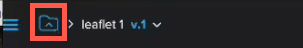
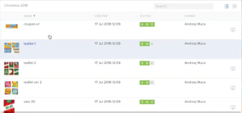

# Utilizzare più bozze nel visualizzatore di bozze

>[!IMPORTANT]
>
>Questo articolo fa riferimento alle funzionalità nel prodotto autonomo [!DNL Workfront Proof]. Per informazioni sulla verifica all&#39;interno di [!DNL Adobe Workfront], vedere [Verifica](../../../review-and-approve-work/proofing/proofing.md).

In [!DNL Workfront Proof] è possibile utilizzare le cartelle per raggruppare le bozze su cui si desidera lavorare insieme o su cui si desidera che i revisori lavorino insieme. Quando uno dei revisori apre una delle bozze avviando il visualizzatore di bozze, sono disponibili anche tutte le bozze presenti nella cartella. Senza uscire dal visualizzatore di bozze, puoi visualizzare le altre bozze, ordinarle, cercarle e confrontarle tra loro.

Per informazioni generali sulle cartelle, vedere [Cartelle in [!DNL Workfront Proof]](../../../workfront-proof/wp-work-proofsfiles/organize-your-work/folders.md).

>[!NOTE]
>
>La capacità di un revisore di aprire una bozza in una cartella dipende dal suo accesso alla bozza. Per informazioni sull&#39;accesso alle bozze, vedere [Generare bozze in [!DNL Workfront Proof]](../../../workfront-proof/wp-work-proofsfiles/create-proofs-and-files/generate-proofs.md).

## Raggruppare le bozze in una cartella

1. In Workfront Proof (all&#39;esterno del visualizzatore di bozze), creare una cartella come descritto in [Crea cartelle in [!DNL Workfront Proof]](../../../workfront-proof/wp-work-proofsfiles/organize-your-work/create-folders.md).
1. Nel dashboard o in una vista a elenco, raggruppa le bozze su cui desideri lavorare insieme trascinandole nella cartella creata.

   

## Rivedere più bozze raggruppate in una cartella

In qualità di revisore, puoi lavorare con più bozze in una cartella senza uscire dal visualizzatore di bozze.

1. In [!DNL Workfront Proof] fare clic sul nome della cartella per aprirla, quindi aprire una bozza nella cartella per avviare il visualizzatore di bozze.

   Oppure

   Apri una bozza da un URL pubblico o da una notifica e-mail, accedendo al sistema come richiesto.

1. Fare clic sull&#39;icona della cartella nell&#39;angolo superiore sinistro del visualizzatore di bozze.

   

   Verrà aperta la cartella contenente la bozza corrente e le altre bozze aggiunte.

   

1. (Facoltativo) Effettua una delle seguenti operazioni con le bozze nella cartella mentre utilizzi il visualizzatore di bozze:

   * Per cercare la bozza desiderata nella cartella, fai clic sulla casella **[!UICONTROL Cerca]** nell&#39;angolo superiore destro sopra l&#39;elenco e inizia a digitare parte del nome della bozza, quindi fai clic sulla bozza quando viene visualizzata.
   * Per ordinare le bozze in base al contenuto di una colonna, fai clic su **[!UICONTROL Nome]**, **[!UICONTROL Creato]**, **[!UICONTROL Stato]** o **[!UICONTROL Proprietario]** sopra l&#39;elenco.

   * Per confrontare due bozze nella cartella, apri una bozza, quindi seleziona l&#39;altra nell&#39;elenco delle cartelle e fai clic sul pulsante [!UICONTROL Confronta] all&#39;estrema destra della bozza (consulta [Confronta bozze nel visualizzatore di bozze](../../../workfront-proof/wp-work-proofsfiles/review-proofs-wpv/compare-proofs.md) per ulteriori informazioni sul confronto di due bozze).

     

     Durante il confronto delle bozze, se si desidera passare a una nuova bozza sul lato sinistro o destro del visualizzatore di bozze, fare clic sul pulsante [!UICONTROL Confronta] sopra la bozza.

     
