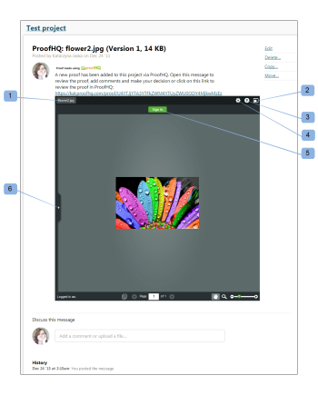

# Crea una mini bozza in [!DNL Workfront Proof]

>[!IMPORTANT]
>
>Questo articolo fa riferimento alle funzionalità nel prodotto autonomo [!DNL Workfront Proof]. Per informazioni sulla verifica all&#39;interno di [!DNL Adobe Workfront], vedere [Verifica](../../../review-and-approve-work/proofing/proofing.md).

La Miniproof è un widget che consente di incorporare una bozza in una pagina web, un blog o un wiki.

La Miniproof mostra la bozza e tutti i commenti e le annotazioni esistenti. Puoi lavorare sulla bozza come se fossi in [!DNL Workfront Proof].

Ecco un esempio di Miniproof incorporato in un progetto Basecamp:

* Nome della bozza (1)
* Schermo intero (2): apre la bozza nel Visualizzatore bozze (al di fuori dell’ambiente in cui è stata incorporata la bozza minima)
* Collegamenti della Guida (3)
* Menu Azioni (4)
* Visualizza commenti nella barra laterale (5)

Per incorporare una miniproof in un sito Web, blog o wiki:

1. Vai alla pagina **[!UICONTROL Dettagli bozza]** di una bozza, come descritto in [Gestisci dettagli bozza in [!DNL Workfront Proof]](../../../workfront-proof/wp-work-proofsfiles/manage-your-work/manage-proof-details.md).

1. Apri la sezione **[!UICONTROL Altre opzioni di condivisione]** della pagina
1. Assicurati che il codice di incorporamento sia abilitato (1).
1. Fai clic sul collegamento [!UICONTROL Copia codice] (2) per copiare il codice da incorporare negli Appunti.
1. Incollare il codice nel sito Web, nel blog o nel wiki su cui si sta lavorando per incorporare la miniproof.

![[!DNL Embed_code].png](assets/embed-code-350x218.png)
