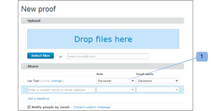

# Gestisci ruoli di bozza in [!DNL Workfront Proof]

>[!IMPORTANT]
>
>Questo articolo fa riferimento alla funzionalità del prodotto standalone [!DNL Workfront Proof]. Per informazioni sulle prove all&#39;interno [!DNL Adobe Workfront], vedi [Copertura](../../../review-and-approve-work/proofing/proofing.md).

I ruoli di bozza ti consentono di concedere autorizzazioni agli utenti che sono limitati dal profilo di autorizzazione configurato sul loro profilo utente. (Per ulteriori informazioni sui profili di autorizzazione, consulta [Profili delle autorizzazioni di prova in [!DNL Workfront Proof]](../../../workfront-proof/wp-acct-admin/account-settings/proof-perm-profiles-in-wp.md).)

I ruoli di bozza sono diversi dai profili account. Il profilo del tuo account si riferisce al livello di autorizzazione generale che hai nel tuo account e influenzerà i diritti che hai su tutte le bozze del tuo account, anche quelle che non sono state condivise esplicitamente con te.

Per ulteriori informazioni, consulta [Profili delle autorizzazioni di prova in [!DNL Workfront Proof]](../../../workfront-proof/wp-acct-admin/account-settings/proof-perm-profiles-in-wp.md).

## Informazioni sui ruoli di bozza

Gli utenti ricevono i seguenti ruoli di bozza per una singola bozza al momento in cui l’utente viene invitato a esaminare la bozza:

* [Sola lettura](#read-only)
* [Revisore](#reviewer)
* [Approvatore](#approver)
* [Revisore e Approvatore](#reviewer-approver)
* [Autore](#author)
* [Moderatore](#moderator)

Il ruolo di bozza definisce le azioni che un revisore può intraprendere in relazione a tale prova specifica.

Ad esempio, se sei un revisore, ti viene chiesto di controllare la bozza aggiungendo annotazioni e commenti. Se sei un Revisore e approvatore, ti viene chiesto di rivedere e anche di prendere una decisione sulla bozza.

Alcuni ruoli di bozza assegnano a un revisore diritti di modifica sulla bozza (anche se il suo profilo account non lo consente) e consentono loro di utilizzare alcune funzioni aggiuntive, come l’aggiunta di azioni sui commenti, la creazione di nuove versioni e l’aggiunta di più revisori alla bozza.

Per ulteriori informazioni, consulta i seguenti articoli:

* [Utilizzare azioni sui commenti della bozza](../../../review-and-approve-work/proofing/reviewing-proofs-within-workfront/comment-on-a-proof/use-actions-on-comments-in-viewer.md)
* [Condividi una bozza in [!DNL Workfront Proof]](../../../workfront-proof/wp-work-proofsfiles/share-proofs-and-files/share-proof.md)

### Sola lettura

{#read-only}

 Visualizzazione di una bozza

 Impossibile aggiungere le marcature

 Impossibile aggiungere commenti

 Impossibile prendere una decisione

 Impossibile eliminare i commenti effettuati da altri

 Non dispone di diritti di modifica sulla bozza

>[!NOTE]
>
>Se una cartella è condivisa con un utente di [!DNL Workfront Proof], gli verranno automaticamente assegnati diritti di sola lettura per tutti gli elementi esistenti e successivamente aggiunti nella cartella.

Per ulteriori informazioni, consulta [Condividi cartelle in [!DNL Workfront Proof]](../../../workfront-proof/wp-work-proofsfiles/organize-your-work/share-folders.md).

### Revisore {#reviewer}

 Visualizzazione di una bozza

 Può aggiungere marcature

 Può aggiungere commenti

![[!DNL cleaner].png](assets/cleaner.png) Può modificare i propri commenti in assenza di risposte

 Impossibile prendere una decisione

 Impossibile modificare o eliminare i commenti creati da altri

 Non dispone di diritti di modifica sulla bozza

### Approvatore {#approver}

 Visualizzazione di una bozza

 Può prendere una decisione

 Impossibile aggiungere le marcature

 Impossibile aggiungere commenti

 Impossibile modificare o eliminare i commenti creati da altri

 Non dispone di diritti di modifica sulla bozza

### Revisore e Approvatore {#reviewer-approver}

 Visualizzazione di una bozza

 Può aggiungere marcature

 Può aggiungere commenti

![[!DNL cleaner].png](assets/cleaner.png) Può modificare i propri commenti in assenza di risposte

 Può prendere una decisione

 Impossibile modificare o eliminare i commenti creati da altri

 Non dispone di diritti di modifica sulla bozza

### Autore {#author}

 Può aggiungere marcature

 Può aggiungere commenti

![[!DNL cleaner].png](assets/cleaner.png) Può modificare i propri commenti in assenza di risposte

 Può prendere una decisione

 Può inviare nuove versioni

 Può creare una copia della bozza

 Può condividere la prova con altre persone

 Può applicare azioni sui commenti

 È possibile risolvere i commenti

 Impossibile modificare o eliminare i commenti creati da altri

>[!NOTE]
>
>Questo ruolo può essere assegnato solo agli utenti di [!DNL Workfront Proof]

### Moderatore {#moderator}

 Può aggiungere marcature

 Può aggiungere commenti

![[!DNL cleaner].png](assets/cleaner.png) Può modificare i propri commenti in assenza di risposte

 Può prendere una decisione

 Può inviare nuove versioni

 Può aggiungere nuovi revisori

 Può applicare azioni sui commenti

 È possibile risolvere i commenti

 Può cancellare commenti e risposte sulla prova (fatti da se stessi o da altri)

* Se elimini il primo commento in un thread di commento, l&#39;intero thread verrà eliminato
* Se si eliminano le risposte nel thread di commento, questa verrà eliminata solo dalla risposta

 Impossibile modificare i commenti effettuati da altri

Questo ruolo consente alla persona di gestire e moderare i commenti della bozza, dando loro la possibilità di conservare solo i commenti pertinenti sulla prova e rimuovere i commenti non pertinenti.

>[!NOTE]
>
>Questo ruolo può essere assegnato solo agli utenti di [!DNL Workfront Proof].

## Assegnazione di ruoli di bozza

Puoi assegnare ruoli di bozza quando crei nuove bozze, crei nuove versioni di bozze esistenti o sulle bozze esistenti.

* [Nuove bozze](#new-proofs)
* [Nuove versioni](#new-versions)
* [Prove esistenti](#existing-proofs)

### Nuove bozze {#new-proofs}

I ruoli di bozza possono essere assegnati ai revisori in [!UICONTROL Nuova prova] durante il processo di creazione della bozza (1).

### Nuove versioni {#new-versions}

Quando si crea una nuova versione di una bozza, vengono visualizzati automaticamente i revisori della versione precedente (con lo stesso ruolo della versione precedente).

Puoi modificare i ruoli di bozza applicati ai revisori durante la creazione della nuova versione (1).

### Prove esistenti {#existing-proofs}

Se desideri modificare il ruolo di una persona su una bozza esistente, puoi farlo in [!UICONTROL Dettagli della bozza] modificando in linea il loro ruolo nella sezione del flusso di lavoro (1):

## Controllo dei ruoli nel visualizzatore delle prove

È possibile controllare il ruolo di un revisore direttamente dal visualizzatore delle prove (1) e modificarlo (2) se necessario.

## Ruoli di prova predefiniti

Puoi impostare il ruolo di bozza predefinito su [!DNL Proofing Defaults] nelle impostazioni Personali. Ciò significa che quando aggiungi una bozza, il ruolo di bozza predefinito verrà popolato automaticamente. Tieni presente che questo ruolo può essere modificato a livello di bozza da un utente con diritti di modifica su una bozza.

>[!NOTE]
>
>Solo gli utenti con profili Amministratore o Amministratore fatturazione possono modificare le impostazioni predefinite di correzione per gli altri utenti nel loro account.

Per ulteriori informazioni, consulta [Impostazioni personali in [!DNL Workfront Proof]](../../../workfront-proof/wp-getstarted/personal-settings/personal-settings.md).

## Creatori e proprietari

I creatori e i proprietari dispongono di diritti di modifica completi sulla bozza.

* [Creatori](#creators)
* [Proprietari](#owners)

### Creatori {#creators}

Il creatore di prove è la persona che carica la bozza nella prima istanza. L’autore della bozza viene visualizzato automaticamente nell’elenco delle persone per la bozza (nel ruolo predefinito).

Sulla [!UICONTROL Nuova prova] è possibile assegnare un ruolo di bozza diverso al creatore della bozza (diverso dal ruolo predefinito).

L’autore della bozza non può essere modificato o rimosso da una bozza.

### Proprietari {#owners}

Per impostazione predefinita, il Creatore è anche il Proprietario della bozza; tuttavia, il Creatore può rendere qualcun altro il Proprietario della bozza quando si crea inizialmente la bozza (nel [!UICONTROL Nuova prova] page).

Per modificare il proprietario nella pagina Nuova bozza:

1. Fai clic sul collegamento di modifica visualizzato accanto al nome del Creatore.
1. Seleziona il nuovo Proprietario dal menu a discesa. (2)

Una volta creata la bozza, è ancora possibile cambiare il proprietario. Chiunque disponga dei diritti di modifica sulla bozza potrà cambiare la proprietà della bozza a un altro utente tramite il [!UICONTROL Dettagli della bozza] (vedere di seguito).

La possibilità di modificare il proprietario di una bozza è particolarmente utile dal punto di vista della gestione del flusso di lavoro. Consente alla persona responsabile del progetto di assumere la proprietà delle bozze, conferendo loro diritti di modifica sulle bozze e la possibilità di visualizzarle nel [!UICONTROL Le mie prove] visualizza.

Per modificare il proprietario della bozza tramite il [!UICONTROL Dettagli della bozza] pagina:

* Fare clic sul menu Azioni accanto al nome della persona che si desidera rendere il proprietario
* Seleziona [!UICONTROL Crea proprietario] dal menu a discesa.
* In alternativa, puoi fare clic su [!UICONTROL Proprietario] accanto all’immagine della bozza e scegli il nuovo Proprietario dal menu a discesa visualizzato.

Una volta fatto questo, accanto al nome della persona verrà visualizzata la parola &quot;Proprietario&quot;.

>[!NOTE]
>
>Solo un utente dello stesso account o un account partner può essere proprietario di una bozza. Un utente di un account partner può essere proprietario di una bozza solo quando:
>
>* Esiste una relazione di partner esistente impostata tra i conti. Per ulteriori informazioni, consulta [Account partner in [!DNL Workfront Proof]](../../../workfront-proof/wp-acct-admin/partner-accounts/partner-accounts.md).
>* Non sono presenti campi personalizzati nel [!UICONTROL Nuova prova] pagina.
>* La bozza non è stata assegnata a una cartella.
>* Non sono stati applicati tag alla bozza.
>

Per delegare temporaneamente la proprietà della prova all&#39;interno di [!DNL Workfront Proof], vedi [Designazione delle prove temporanee dei proprietari in [!DNL Workfront Proof]](../../../workfront-proof/wp-getstarted/personal-settings/designate-temp-proof-owners.md).
